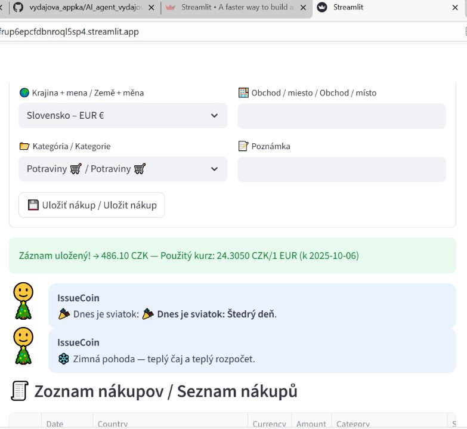
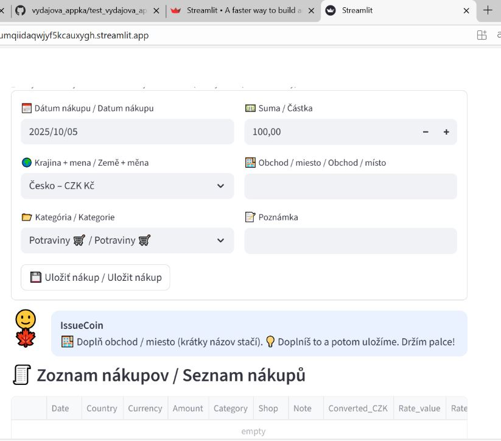

# 💰 Výdavkový denník / Výdajový deník — s AI agentom IssueCoin

[](https://vydajovaappka-yumqiidaqwjyf5kcauxygh.streamlit.app/)
[](./LICENSE)

> Bilingválny výdavkový denník (SK/CZ + EN) v Streamlite s AI agentom **IssueCoin**.  
> Využíva **RAG** nad lokálnymi znalosťami + **2 externé API** (ČNB denné kurzy, Calendarific sviatky), má sezónne hlášky a beží **GDPR-friendly** (dáta ostávajú lokálne v session).

---



## ✨ Funkcie

- **Bilingválna appka**: prepínač *Slovensky/Česky* ↔ *English* (texty sú oddelené, nemiešajú sa).
- **Meny**: všetko sa prepočítava do CZK (CZK=1:1), ostatné meny podľa **denných kurzov ČNB** (s fallbackom na posledný dostupný kurz).
- **Sviatky**: **Calendarific** (public holiday vs. observance), pre SK/CZ vlastné preklady + lokálny fallback.
- **AI agent IssueCoin**:
  - pred uložením upozorní na chýbajúce polia (dátum, suma, obchod…),
  - po uložení dá krátku, priateľskú spätnú väzbu k **danej kategórii** (bez „mimo témy“),
  - upozorní na **graf** nižšie a zhrnie **dnešný súčet a počet nákupov**.
- **Sezónne okná** (špeciálny tón hlášok):  
  Vianoce **20.–27.12.**, Silvester **29.–31.12.**, januárové výpredaje, **Black Friday 15.–25.11.**, **Veľká noc: Zelený štvrtok (Maundy Thursday) → Veľkonočný pondelok (Easter Monday)**.
- **Prehľad**: Altair stĺpcový graf podľa kategórií + **CSV export**.  
- **GDPR-friendly**: bez serverového úložiska; dáta ostávajú u používateľa (session).

---

## 🧠 RAG – pragmaticky



- **Retrieval**: fakty beriem z lokálnej znalostnej bázy (kategórie, prahy, sezónne okná), z **ČNB** a **Calendarific** (s fallback tabuľkou).
- **Augmentation**: poskladám kontext (jazyk, dátum, krajina, kategória, sviatok/sezóna).
- **Generation**: krátke, ľudské hlášky IssueCoin-a – k veci, bez miešania tém, vždy slušné a neútočné.

Tento prístup je rýchly, stabilný a predvídateľný pre produkčné UI.

---

## 🔌 API

- **Česká národná banka (ČNB)** — denné textové kurzy  
  Použitý kurz k zvolenému dátumu (ak chýba → posledný dostupný); vždy konverzia do CZK.
- **Calendarific** — štátne sviatky + observances  
  Rozlišujem *public holiday* vs. *observance*; pre SK/CZ mapujem známe sviatky; ak API nič nevráti, použije sa lokálny fallback.

> API kľúč na Calendarific je uložený v `st.secrets`.

🗂️ Stručná architektúra

Streamlit UI
i18n slovníky (SK/CZ + EN)
IssueCoin (pravidlá + RAG kontext)
Altair graf + CSV export
Cache: @st.cache_data (ČNB ~10 min, Calendarific ~60 min)
Fallbacky: posledný kurz ČNB; lokálna tabuľka sviatkov pre vybrané krajiny

📜 Licencia

Projekt je pod licenciou MIT [LICENSE](LICENSE)

---

## 🖥️ Lokálne spustenie

```bash
python -m venv .venv
# Windows:
.venv\Scripts\activate
# macOS / Linux:
# source .venv/bin/activate

pip install -r requirements.txt
streamlit run test_vydajova_appka_app.py
CAL_API_KEY = "tvoj_calendarific_api_key"


